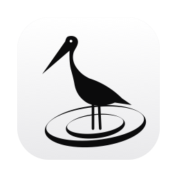
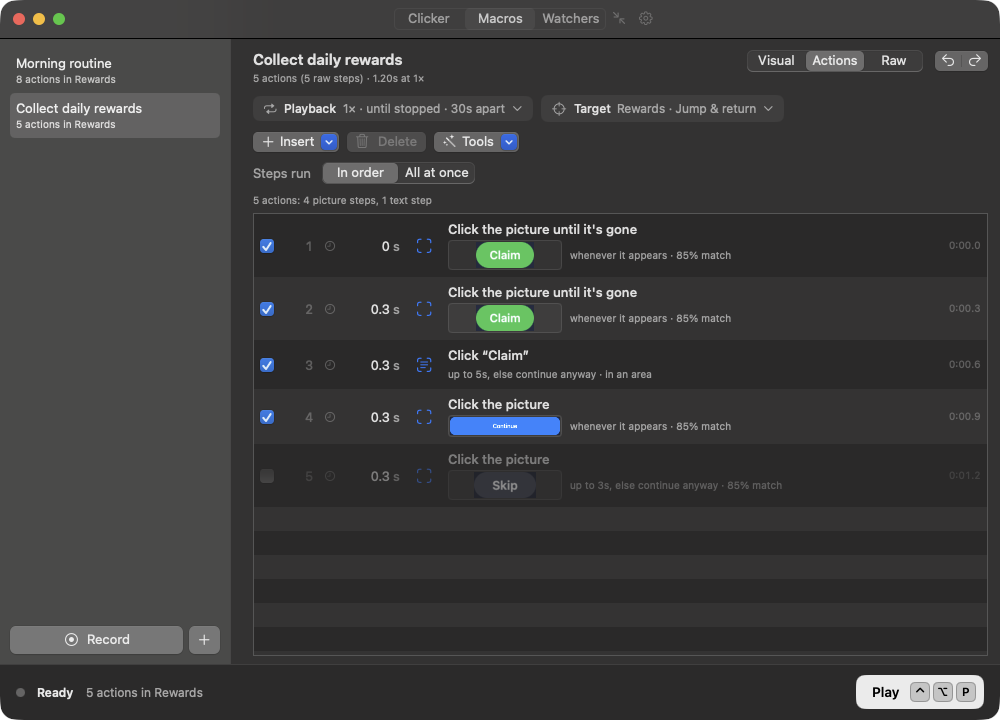
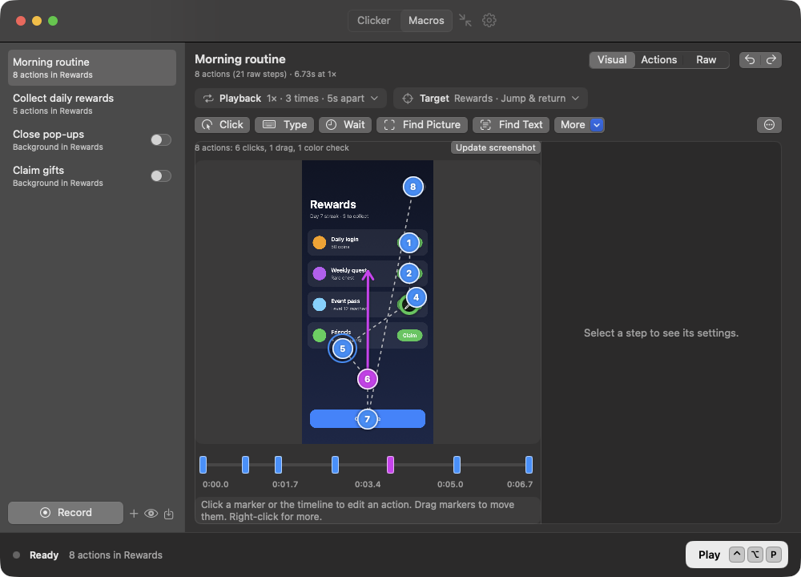
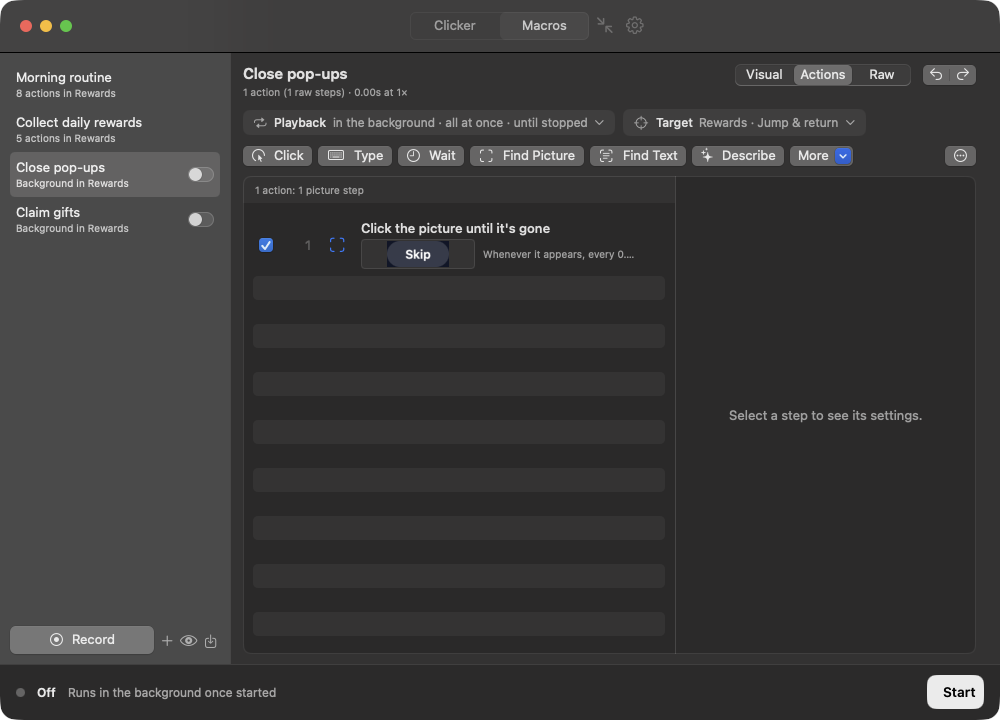
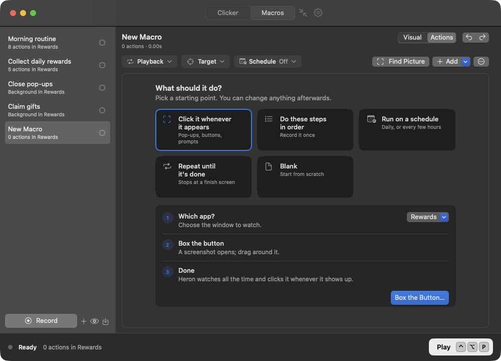
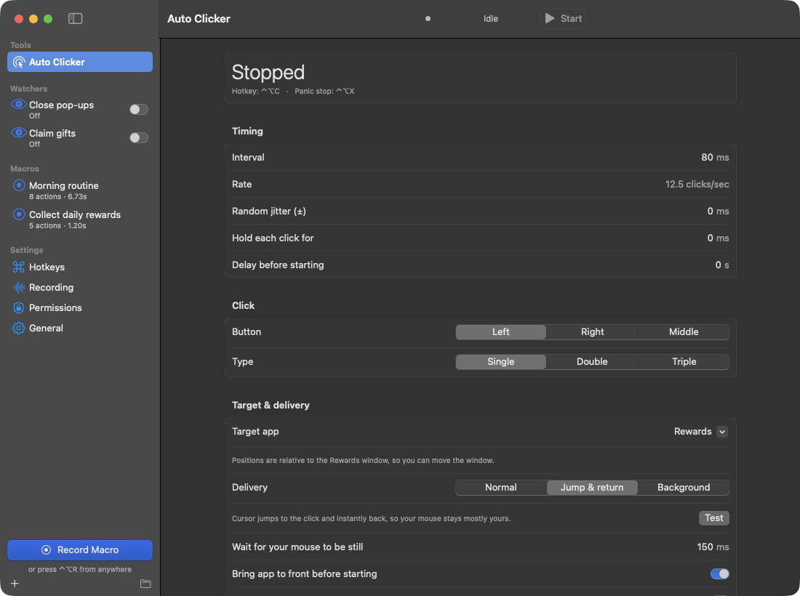
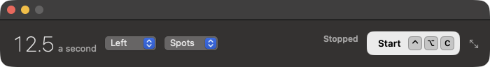

<p align="center">
  
</p>

<h1 align="center">Heron</h1>

<p align="center">
  <b>Free, easy automation for your Mac. It sees your screen.</b><br>
  Start from a template or record what you do. Heron finds buttons and words wherever they appear,<br>
  runs on a schedule, and stops by itself when the job is done. A fast auto clicker is built in.
</p>

<p align="center">
  <a href="#install">Install</a> ·
  <a href="#everything-it-does">Everything it does</a> ·
  <a href="#private-by-default">Privacy</a>
</p>

<p align="center">
  
  
  
</p>

<p align="center">
  
</p>

## Why Heron

**It sees the screen.** Point it at a picture or a word in any window, like a Close button or “Claim”, and it
clicks it the moment it appears, wherever it appears. Words are read on your Mac with Apple's built-in text
recognition.

**Start in seconds.** A new macro asks what it should do: click something whenever it appears, do some
steps in order, run on a schedule, or repeat until it's done. Answer a question or two and it's set up.

**Record once, and it finds things for you.** Every tap you record becomes a step that finds what you
tapped, by its picture or its words, wherever it is next time. A recording shows up as numbered taps on top
of the window, with a timeline, instead of hundreds of raw events.

**Runs on its own.** Start a macro every morning, every few hours or when an app opens, and have it stop
when a “finished” screen appears. Heron keeps the screen awake while it works and tells you how it went.

**Runs in the background.** Switch on a macro that clicks pop-ups whenever they show up, while another
macro plays or you keep working.

**And a proper auto clicker.** For plain fast clicking: set the speed, press a hotkey, done. Simple mode shrinks it to a small strip
that stays on top.

**Free, private and made for the Mac.** No account, no subscription, no network code. Everything stays on
your Mac.

<table>
  <tr>
    <td></td>
    <td></td>
  </tr>
  <tr>
    <td align="center">Recordings as a map</td>
    <td align="center">Background macros</td>
  </tr>
  <tr>
    <td></td>
    <td></td>
  </tr>
  <tr>
    <td align="center">Start from a template</td>
    <td align="center">Pictures and words</td>
  </tr>
  <tr>
    <td></td>
    <td></td>
  </tr>
  <tr>
    <td align="center">Auto clicker</td>
    <td align="center">Simple mode</td>
  </tr>
</table>

## Install

**[Download the latest release](https://github.com/andrew-c-lo/Heron/releases/latest)**, unzip it and drag
Heron to Applications. It runs on Apple silicon and Intel Macs with macOS 14 or later.

Heron isn't notarized by Apple, so the first time you open it macOS asks first: open it once, then
go to **System Settings › Privacy & Security** and click **Open Anyway** next to “Heron was blocked”.
After that, allow the permissions it asks for. A banner links to the right place in System Settings.

<details>
<summary>Build it yourself instead</summary>

It takes about a minute with Apple's free command line tools:

```bash
xcode-select --install     # once, if you don't have the command line tools
git clone https://github.com/andrew-c-lo/Heron.git
cd Heron
scripts/setup-signing.sh   # once: a personal signing certificate, so permissions survive rebuilds
./build.sh install         # builds Heron.app and copies it to /Applications
```

</details>

## Everything it does

<details>
<summary><b>Auto clicker</b></summary>

- Set the speed in clicks a second, or an exact interval in milliseconds
- Left, right or middle button; single, double or triple clicks; hold each click
- Click wherever the pointer is, or cycle through spots you pick by hovering and pressing a hotkey
- Stop after a number of clicks, after some time, or when you press the hotkey
- Vary the timing a little so the rhythm isn't exact
- Only click when the color at a spot matches, picked with the eyedropper or typed as a hex code
- Simple mode: a small strip with just the speed and Start that stays above other windows

</details>

<details>
<summary><b>Start, record and build macros</b></summary>

- Templates: a new macro asks what it should do (click something whenever it appears, steps in order,
  run on a schedule, repeat until done) and sets itself up
- Record mouse and keyboard, or just one app's window. Every tap becomes a step that finds what you tapped,
  by its picture, its words or both, and taps the recorded spot if it isn't there. Several quick taps on one
  spot become “keep tapping until it's gone”
- Build step by step: Find Picture, and an Add menu with every kind of step, from clicks and key presses to
  waits and repeats. The selected step's settings show beside the list, with fine-tuning folded away
- Type text, or Type from a list: each run types the next item (codes, names, numbers), remembers where it
  got to, and stops or starts over at the end
- Suggestions from your own taps: things you press yourself while a macro plays are offered as steps
- See a macro as a map of the window with every tap, a readable list, or every raw event
- Reorder by dragging, from the right-click menu, or with ⌥⌘↑ and ⌥⌘↓; switch steps off without deleting
  them; keep macros in folders
- Branch and repeat: a step that isn't found can go to another step, and a Repeat step goes back to an
  earlier one a set number of times
- Undo and redo for every edit, and global hotkeys for everything, including a panic stop

</details>

<details>
<summary><b>Finding pictures and words</b></summary>

- Look for a picture, some words (read on your Mac), or both, whichever shows up first
- Click it, just wait for it, wait until it's gone, or stop the macro when it appears
- Pick pictures by drawing a box on a screenshot, with zoom and pixel-precise handles
- Several pictures of the same thing (different states or colours) can count as one step
- Draw a box on the picture and each click lands on a different spot inside it
- Limit any search to an area of the window; after a few runs Heron can narrow searches to where things
  actually showed up
- Pictures and positions resize with the window, so a bigger or smaller window still works
- Waits for things to stop moving before clicking, and the wait before clicking can be a random range
- Spot: switch any step to click fixed coordinates without looking, and back again, keeping its picture
- Fast: even large pictures are checked in a few milliseconds, so many steps can be watched at once
- Test Now shows whether it's on screen right now and how close the match is

</details>

<details>
<summary><b>Running: in order, all at once, on a schedule</b></summary>

- Run steps in order, or all at once: every picture is watched together and whichever appears gets clicked,
  taking turns or with higher steps winning
- Replay at any speed, once, a number of times, until stopped or for a set time, with a random pause between rounds
- Vary the timing so waits between steps come a little early or late
- Stop when it appears: a picture or words that end the run as soon as they show up, like a “Finished” screen
- Schedule: daily at set times (pick the weekdays), every few hours, or when the app opens, with a time
  limit and a notification when it's done. Optionally open Heron at login
- Keep the screen on while a macro runs, so the screen saver and auto-lock don't stop it
- Tap when stuck: if nothing shows up for a while, tap a spot you choose, and keep that screen under Stuck
  Screens so you can turn it into a step
- Background macros: any macro can keep running alongside others. Every macro in the list has a dot that
  turns green while it runs; click it to start or stop
- After a run, see how often each step fired

</details>

<details>
<summary><b>On-device help</b></summary>

With Apple Intelligence (macOS 26 or later), all on your Mac and never sent anywhere:

- Describe: write what to do (“tap Claim, wait 2 seconds, tap Close”) and the steps are drafted for you
- Suggest: on a stuck screen, the word to tap is picked from the words actually on it
- Autopilot (experimental): give a goal and Heron taps toward it one on-screen word at a time

</details>

<details>
<summary><b>Clicking that stays out of your way</b></summary>

- Jump & return (the default): the cursor jumps to each click and straight back, and waits until you've
  stopped moving the mouse
- Background delivery for apps that accept it, without moving the cursor at all
- Positions are relative to the app's window, so moving the window doesn't break anything
- Randomize click position: each click lands at a random spot near its target (or anywhere in a picture's
  click box)
- Optional double-click everywhere: every single click is sent as a double click, with a hotkey to flip it
- A notification if something stops on its own while you're in another app

</details>

## Private by default

Heron runs entirely on your Mac. It has no accounts, no analytics and no network code at all, and
text recognition happens on-device. Macros are readable `.json` files in
`~/Library/Application Support/Heron` that you can back up, edit or share.

It asks only for the permissions a feature needs:

| Permission | Used for |
|---|---|
| Accessibility | Clicking, moving the mouse and typing |
| Input Monitoring | Recording your mouse and keyboard |
| Screen Recording *(optional)* | Color checks, finding pictures and words, smart recording and the map view. Only the target window is read, and nothing is saved except the pictures you pick |

## When something misbehaves

- **A permission stopped working after an update**: remove Heron from that list in System Settings
  › Privacy & Security and add it again
- **The cursor didn't come back after a click**: every jump and return is logged in
  `~/Library/Application Support/Heron/jump-log.txt`
- **A picture isn't found**: use **Test Now** to see how close the match is, crop the picture more tightly,
  or lower the match strictness a little

## Contributing

Issues and pull requests are welcome. `Tests/qa/run.sh` runs the tests (the screenshot cropper, click
spread and click boxes, double-click, finding pictures and words, resizing, scheduling, playback and lists), and `scripts/make-demo.sh --screenshots`
regenerates the screenshots on this page from neutral demo data. `scripts/qa-sweep.sh` captures every page at three window sizes in light and dark for a visual check, and
`scripts/release.sh` builds the app for
both kinds of Mac and publishes a release with the notes in `docs/release-notes/`.

## License

GPL 3.0. See [LICENSE](LICENSE).

<p align="center">Made by <a href="https://github.com/andrew-c-lo">@andrew-c-lo</a></p>
