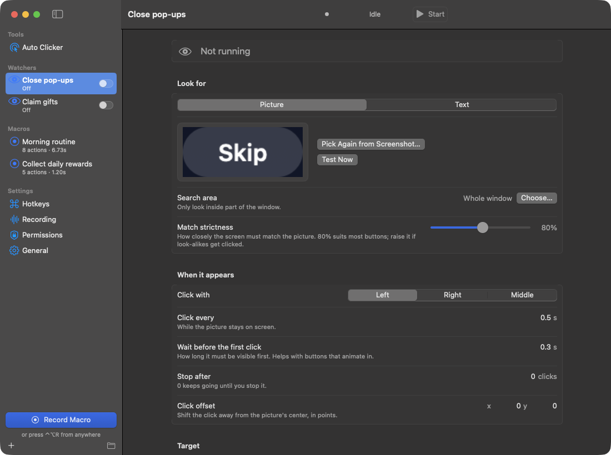
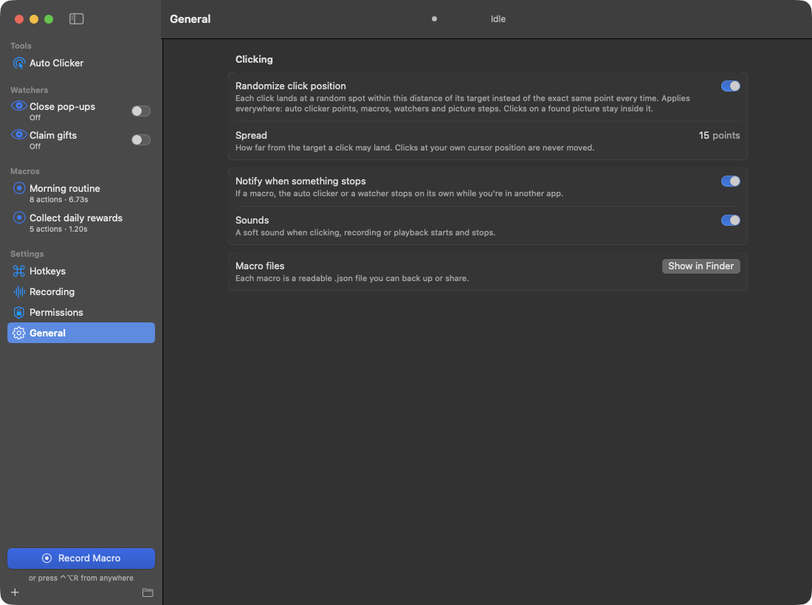

<p align="center">
  
</p>

<h1 align="center">MacroClicker</h1>

<p align="center">
  A free, open-source auto clicker and macro recorder for the Mac.<br>
  Click on a timer, record and replay what you do, or let it click buttons the moment they appear.
</p>

<p align="center">
  <a href="#everything-it-does">Features</a> ·
  <a href="#install">Install</a> ·
  <a href="#private-by-default">Privacy</a> ·
  <a href="#build-it-yourself">Build</a> ·
  <a href="#license">License</a>
</p>

<p align="center">
  
  
  
  
</p>

<p align="center">
  
</p>

Most auto clickers for the Mac cost money, want a subscription, or stop at "click here every second".
MacroClicker is a native Mac app that does the simple thing well and keeps going: record what you do and
replay it, see a recording as taps and swipes on a map instead of hundreds of raw events, and build chains
that wait for a button to appear before tapping it. It works with any app or window.

## Everything it does

### Auto clicker

- Click on an interval (shown in clicks per second), with optional random jitter and hold time
- Left, right or middle button; single, double or triple clicks
- Follow the cursor, or cycle through fixed points you add by hovering and pressing a hotkey
- Stop after a number of clicks, after a duration, or never
- Only click when the color under a point matches, picked with the eyedropper or typed as a hex code

<p align="center">
  
</p>

### Record and replay

- Records mouse moves, clicks, drags, scrolls and keystrokes, and can record just one app's window
- Replay at any speed, once, a number of times, until stopped, or for a set duration
- A wait between loops, with a random extra so every pause is a little different
- Global hotkeys for everything, including a panic stop

### See what a macro does

- **Visual**: the target window with a numbered marker for every tap, arrows for swipes, and a timeline.
  Drag a marker to move a tap
- **Actions**: a readable list, such as "Tap", "Swipe up", "Type “hello”", with editable waits and positions
- **Raw**: every recorded event, for the details
- Undo and redo for every edit

### Picture steps and chains

- A picture step waits for a picture to appear in the target window, then clicks it wherever it is.
  It can also just wait for it, or wait until it's gone
- Chains are macros built from picture steps. Run them in order, or **all at once**, where every
  picture is watched at the same time and whichever appears gets clicked
- Keep tapping until a picture is gone, wait before tapping, click at an offset, and choose what
  happens if a picture never shows up
- Pick pictures by drawing a box on a screenshot, with zoom, panning and pixel-precise handles
- **Text steps** look for words instead of a picture, such as “Claim”, read on your Mac with Apple's
  built-in text recognition. Exact matches win over longer lines that merely contain the word
- Limit any search to an **area** of the window, so it's faster and ignores look-alikes elsewhere
- Switch any action **on or off** without deleting it

<p align="center">
  
</p>

### Watchers

- Keep an eye on a window and click a button whenever it appears, for example to close pop-ups,
  while your macros and chains keep running
- Matching looks at both the overall shape and the middle of the picture, so a button with the same
  frame but different text isn't mistaken for it
- Watch for text instead of a picture, optionally only in part of the window
- Start and stop each watcher with its switch in the sidebar

<p align="center">
  
</p>

### Clicking that stays out of your way

- **Jump & return**: the cursor jumps to each click and straight back, and waits until you've stopped
  moving the mouse
- **Background** delivery for apps that accept it, without moving the cursor at all
- Positions are stored relative to the target app's window, so moving the window doesn't break anything
- Optional click spread: every click lands at a random spot within a radius you choose, and clicks on a
  found picture always stay inside it
- A notification if something stops on its own while you're in another app, such as a chain that
  gave up waiting or a watcher that reached its click limit

<p align="center">
  
</p>

## Install

MacroClicker is built from source for now, which takes a minute with Apple's free command line tools.
See [Build it yourself](#build-it-yourself).

## Private by default

MacroClicker runs entirely on your Mac. It has no accounts, no analytics and no network code at all.
Text recognition happens on-device too. Macros are readable `.json` files in `~/Library/Application Support/MacroClicker`, which you can back
up, edit or share.

It asks only for the permissions a feature needs, and works without the optional one:

| Permission | Used for |
|---|---|
| Accessibility | Clicking, moving the mouse and typing |
| Input Monitoring | Recording your mouse and keyboard |
| Screen Recording *(optional)* | Color checks, picture steps, watchers and the screenshot in the Visual view. Only the target window is read, and nothing is saved except the screenshots and pictures you choose |

## What you need

- macOS 14 Sonoma or later
- Apple's Command Line Tools to build it (`xcode-select --install`)

## Build it yourself

```bash
git clone https://github.com/andrew-c-lo/MacroClicker.git
cd MacroClicker
scripts/setup-signing.sh   # once: a personal signing certificate, so permissions survive rebuilds
./build.sh install         # builds MacroClicker.app and copies it to /Applications
```

Then open MacroClicker and allow the permissions it asks for (a banner links to the right place in
System Settings).

## When something misbehaves

- **A permission stopped working after an update**: remove MacroClicker from that list in System Settings
  › Privacy & Security and add it again
- **The cursor didn't come back after a click**: every jump and return is logged in
  `~/Library/Application Support/MacroClicker/jump-log.txt`, which shows what happened
- **A picture isn't found**: use **Test Now** to see how close the match is, crop the picture more
  tightly, or lower the match strictness a little

## Contributing

Issues and pull requests are welcome. The cropper and click-spread logic have tests you can run with
`Tests/qa/run.sh`, and `scripts/make-demo.sh --screenshots` regenerates the screenshots on this page from
neutral demo data.

## License

GPL 3.0. See [LICENSE](LICENSE).

<p align="center">Made by <a href="https://github.com/andrew-c-lo">@andrew-c-lo</a></p>
